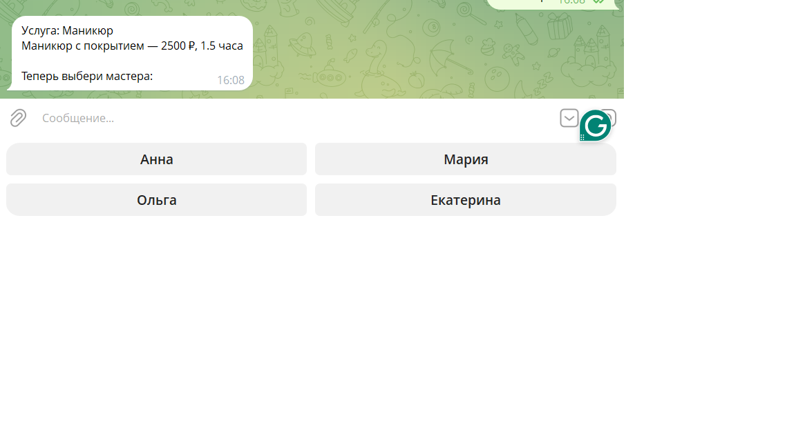
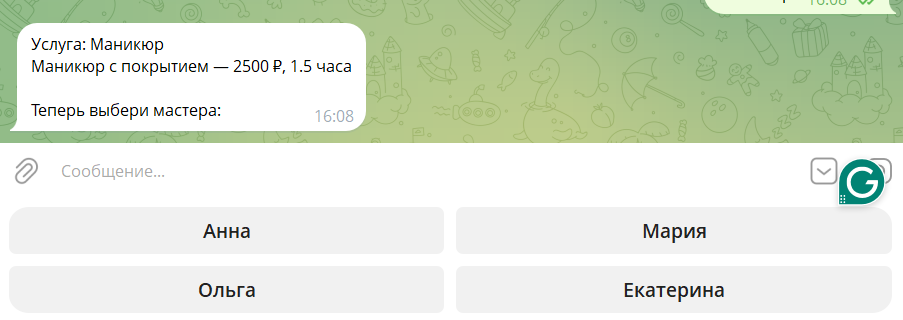
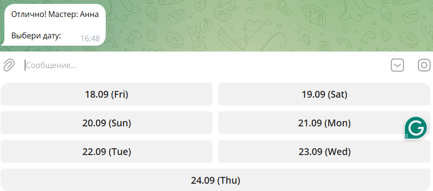
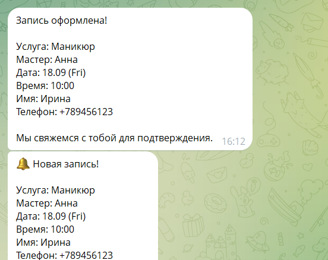

# 🤖 Telegram-бот для записи в салон красоты

Бот для автоматизации записи клиентов в салон красоты. Клиент выбирает услугу, мастера, дату и время — администратор получает уведомление в Telegram.

## ✨ Возможности

- 📋 Выбор услуги с ценами и длительностью
- 👩‍🎨 Выбор мастера
- 📅 Выбор даты из ближайших 7 дней
- ⏰ Выбор удобного времени из свободных слотов
- 📝 Сбор имени и телефона клиента через FSM
- 💾 Сохранение записей в SQLite
- 🔔 Мгновенное уведомление администратору о новой записи
- 🌐 Работа через собственный прокси на Cloudflare Workers

## 🛠️ Технологии

- **Python 3.14**
- **aiogram 3.31** — фреймворк для Telegram-ботов
- **SQLite** — база данных для записей
- **python-dotenv** — хранение токенов в `.env`
- **Cloudflare Workers** — обход блокировок Telegram API

## 📸 Как это выглядит

### Главное меню



### Выбор мастера



### Выбор даты и времени



### Уведомление администратору



## 🚀 Установка и запуск

1. Клонируй репозиторий:
   ```bash
   git clone https://github.com/diliara-match/beauty-salon-bot.git
   cd beauty-salon-bot
